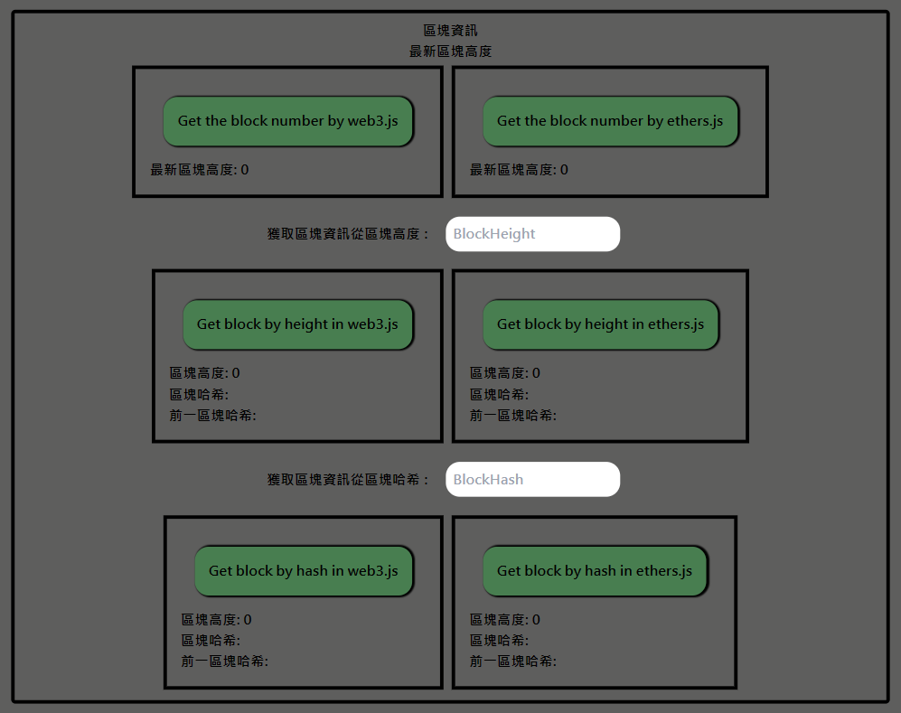

# DApp (Decentralized Application)
## What is DApp (Decentralized Application) ?
A DApp (Decentralized Application) is a software application that operates on a decentralized blockchain network, offering transparency, security, and trust through smart contracts.

## What is the DApp (Decentralized Application) feature
1. My introduction to the blockchain
2. Connect with MetaMask
3. Get th blockchain information
4. Build transactions with MetaMask
5. Interact with contracts

## How to install
```shell
# Ensure have installed git
git clone https://github.com/weiawesome/dapp_website.git
```
## How to start
### Start Locally
```shell
# Ensure have installed npm
npm install
npm run build
npm start
```
### Start with Docker
```shell
# Ensure have installed docker
docker build -t image-name .
docker run -d --name container-name -p 3000:3000 image-name
```
Then can see the website in http://localhost:3000

---

# WebSite main function and its UI

## 1. Index
### The Introduction to blockchain

### The introduction article and its filter


### The author's contact method


## 2. Connect Wallet
### Connect MetaMask to get account information


## 3. Get BlockChain information
### Specific blockchain network or by MetaMask


### Block information

* Get the latest block height
* Search block by block height
* Search block by block hash

### Transaction information

* Search transaction by transaction hash

## 4. Build Transaction
### Connect MetaMask and build transaction


## 5. Contract Interact

* Provide contract address and ABI file to interact


